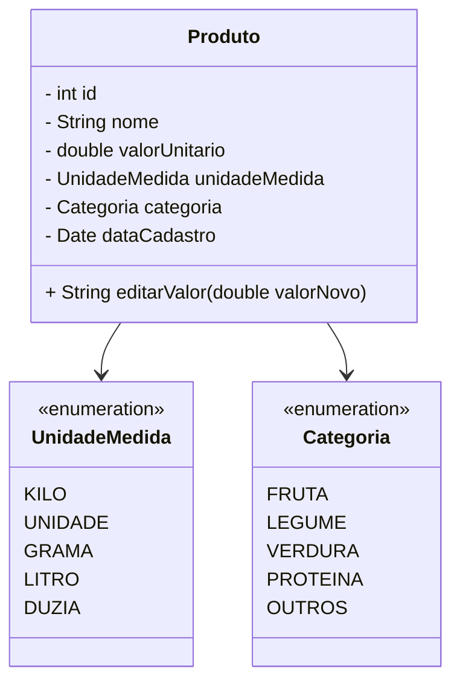

# PIM4 – Hortifruti Malunga

```mermaid
classDiagram
    class Produto{
      -int id
      -String nome
      -double valorUnitario
      -UnidadeMedida unidadeMedida
      -Categoria categoria
      -Date dataCadastro
      +String editarValor(double valorNovo)
    }

    enum UnidadeMedida{
      KILO
      UNIDADE
      GRAMA
      LITRO
      DUZIA
    }

    enum Categoria{
      FRUTA
      LEGUME
      VERDURA
      PROTEINA
      OUTROS
    }

    Produto --> UnidadeMedida
    Produto --> Categoria

