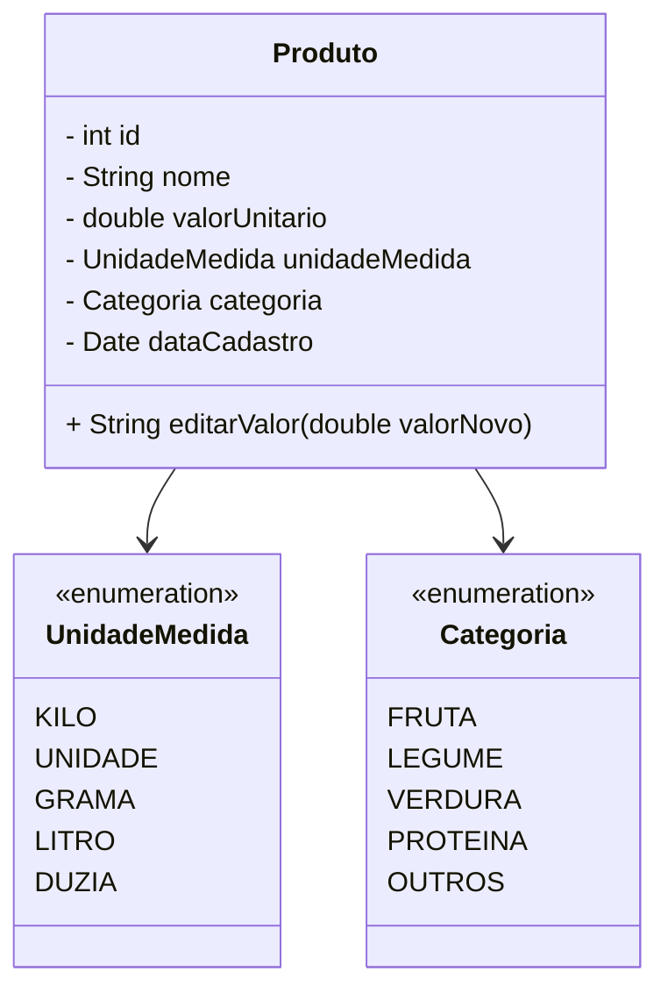

<<<<<<< HEAD



## BORD 
```mermaid
classDiagram
    Cliente "1" --> "N" Pedido
    Pedido "1" --> "N" ItemPedido
    ItemPedido "N" --> "1" Produto
    Produto --> Categoria
    Produto --> UnidadeMedida
    Estoque "1" --> "N" Produto

    class Cliente
    class Pedido
    class ItemPedido
    class Produto
    class Categoria
    class UnidadeMedida
    class Estoque
=======
# Hortifruti Malunga - Sprint 0

Projeto acadêmico (PIM IV) desenvolvido em C# com ASP.NET Core. O objetivo da sprint 0 é garantir que o ambiente sobe com banco SQL Server, API disponível e base de dados mínima para evoluir nas próximas sprints.

## Estrutura
- `api/Hortifruti.Api` – API ASP.NET Core (Controllers, Data, Models, Services).
- `docs/` – materiais vindos dos PIMs anteriores.
- `docker-compose.yml` – sobe SQL Server + API.

## Pré-requisitos
- Docker Desktop + WSL2 habilitado.
- .NET SDK 9.0 (ou superior compatível).
- Git.

## Como executar (Sprint 0)
1. Copie o arquivo de exemplo e ajuste as variáveis:
   ```bash
   cp .env.example .env
   ```
2. Suba os serviços:
   ```bash
   docker compose up -d --build
   ```
3. Verifique os endpoints principais:
   - Health check: `http://localhost:8080/health`
   - Status: `http://localhost:8080/api/status`
4. Login para obter JWT:
   ```http
   POST http://localhost:8080/api/auth/login
   {
     "email": "admin@hortifruti.local",
     "password": "Admin@123"
   }
   ```
   Use o token nas requisições autenticadas (ex.: `GET /api/products`).

## Banco de dados
- SQL Server roda no contêiner `hortifruti-sqlserver`.
- Scripts automáticos criam as tabelas e inserem:
  - Usuário admin (`admin@hortifruti.local`).
  - Categorias e produtos exemplo (unidade e peso).

## Próximos passos (sprints seguintes)
- Implementar CRUD de categorias, produtos e clientes.
- Adicionar migrations, testes automatizados e pipeline CI/CD.
- Evoluir regras de estoque, vendas, alertas e relatórios conforme plano de ação.

## Referências
- Documentos do PIM (disponíveis em `docs/pim4tudao-...`).
- Plano de ação com backlog completo.
>>>>>>> 1e52c75 (Sprint 0 base)

