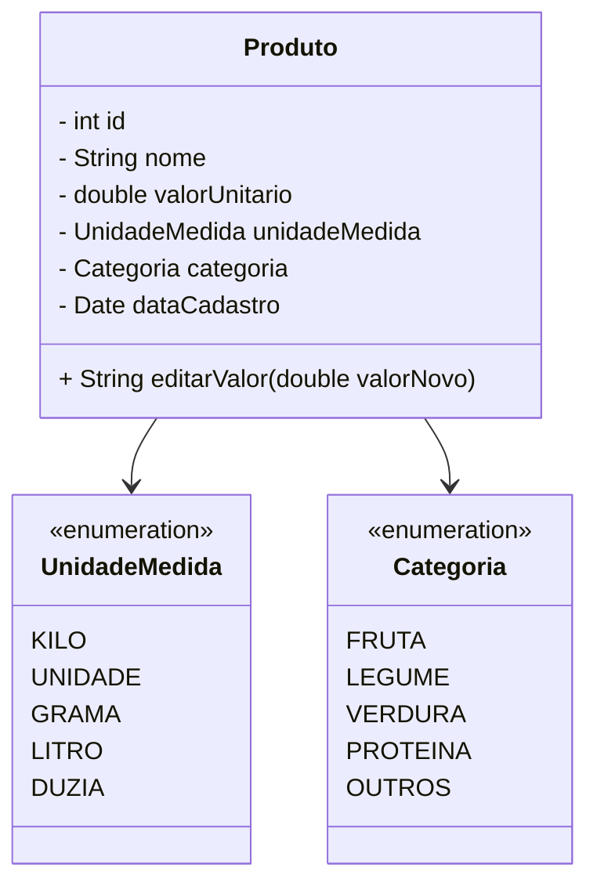

## BORD 
```mermaid
classDiagram
    Cliente "1" --> "N" Pedido
    Pedido "1" --> "N" ItemPedido
    ItemPedido "N" --> "1" Produto
    Produto --> Categoria
    Produto --> UnidadeMedida
    Estoque "1" --> "N" Produto

    class Cliente
    class Pedido
    class ItemPedido
    class Produto
    class Categoria
    class UnidadeMedida
    class Estoque

